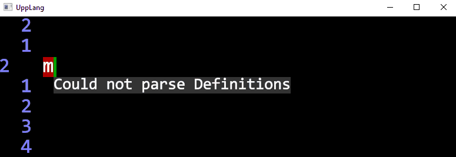
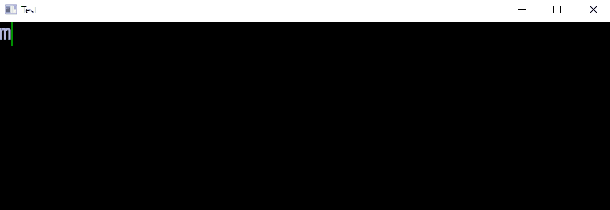
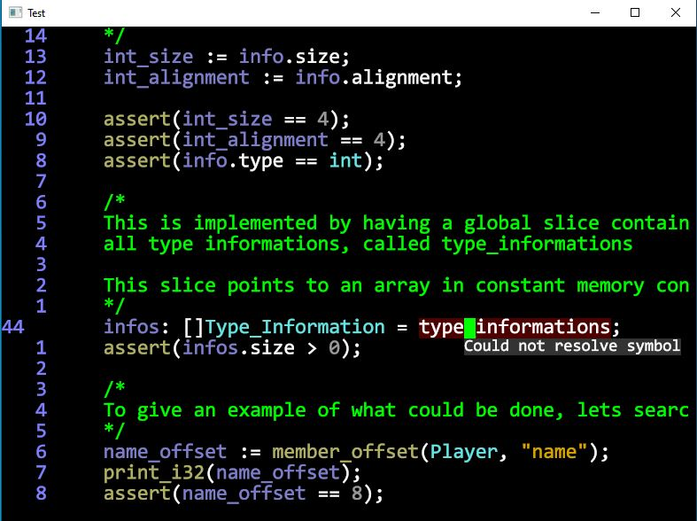
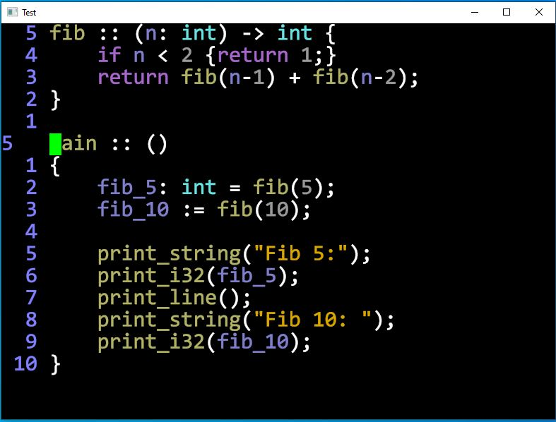

# UppLang
UppLang is a combined IDE and Programming-Language currently under development by myself (Martin R).
Although my End-Goal with this project is to create a usable language as an replacement for C/C++ for other Hobby-Projects of mine, the focus of UppLang is my personal education and research.

The 3 big features I would like to (try) implementing are:
* Compile-Time Code-Execution
* Syntax-Guided IDE
* Integrated Static-Analysis (Experimental)

The design of UppLang is strongly influenced by the following other Programming-Languages:
* Jai (Based on Jonathan Blow's development videos)
* Odin
* Zig

# Current Features

Right now the Project contains a functional Text-Editor (Vim-Keybindings), and Source-Code can be compiled and executed as Bytecode, or translated to C and then compiled with the MSVC Compiler (C-Backend will be replaced with LLVM at some point).

Currently there is no documentation about all features of the Language itself, but the Testcases (upp_code/testcases/*) are a starting point for interested readers, some of them also document some of the design-decisions. The most interesting testcases probably are:
* 011_pointer.upp
* 033_constant_propagation.upp
* 036_bake.upp
* 046_types_as_values.upp
* 047_type_info.upp
* 050_named_break_continue.upp

At the moment the only way to get proper syntax highlighting for the Test-Case Code is to copy-paste it into the editors save file (upp_code/editor_text.upp) and running the editor.

# Progress

Right now I am reworking the Syntax to be more Python-like and creating a Syntax-Guided Editor for the language. Most of the Ideas I have for the editor are based on the 2020 Dion-Systems Demo (https://dion.systems/gallery.html)

# Running and Building
To build/run the current state of the Program you need a Windows 10 PC and Visual Studio 2019. If you just want to try out the Program, it is probably better to use one of the prebuilt executables (Folder old_builds). 
!!! Right now no Documentation is available on how to use the Program, only the Comments in  "old_builds/Vim_IDE_Newest"

# Gallery

