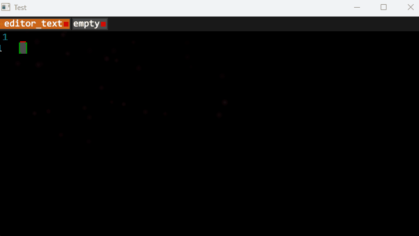
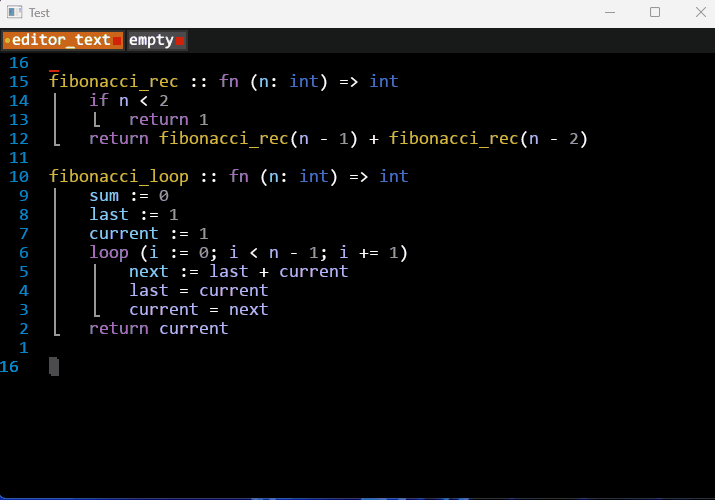
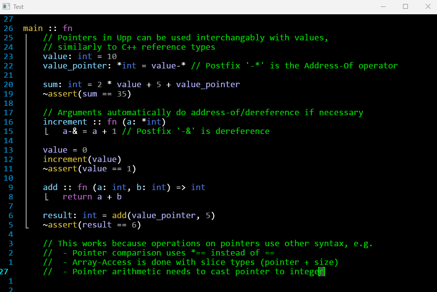
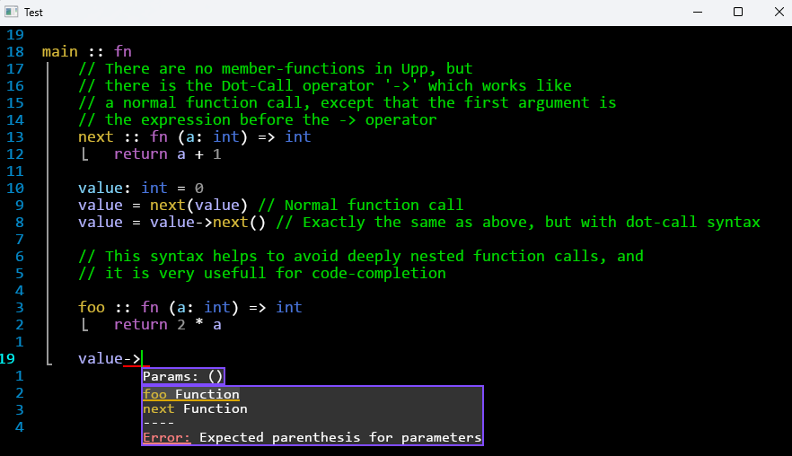
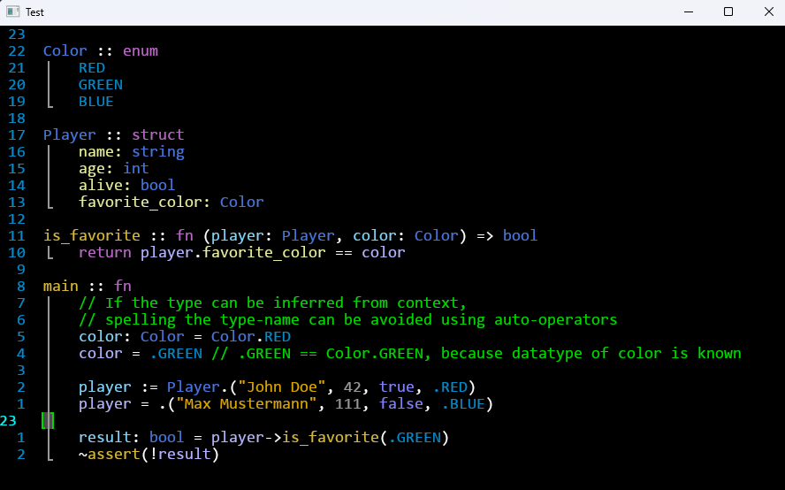
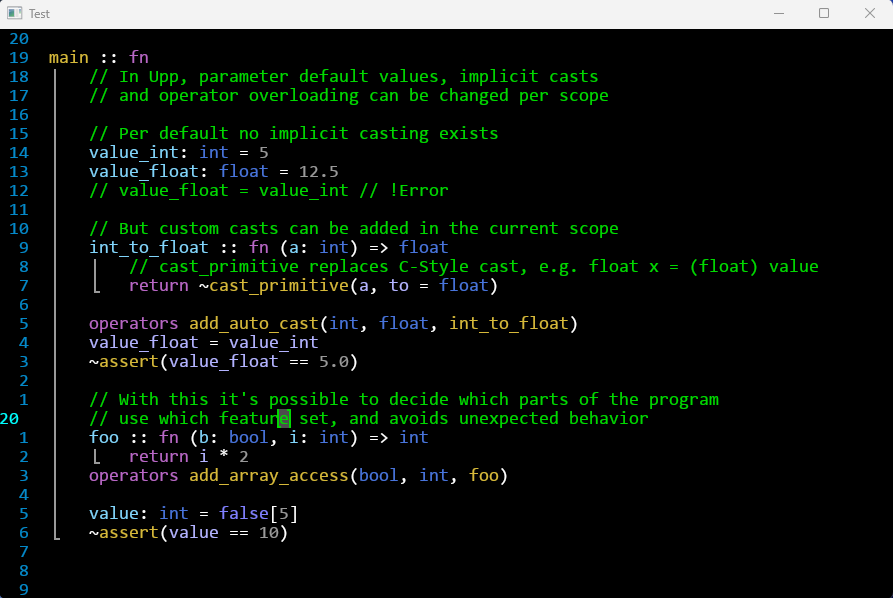
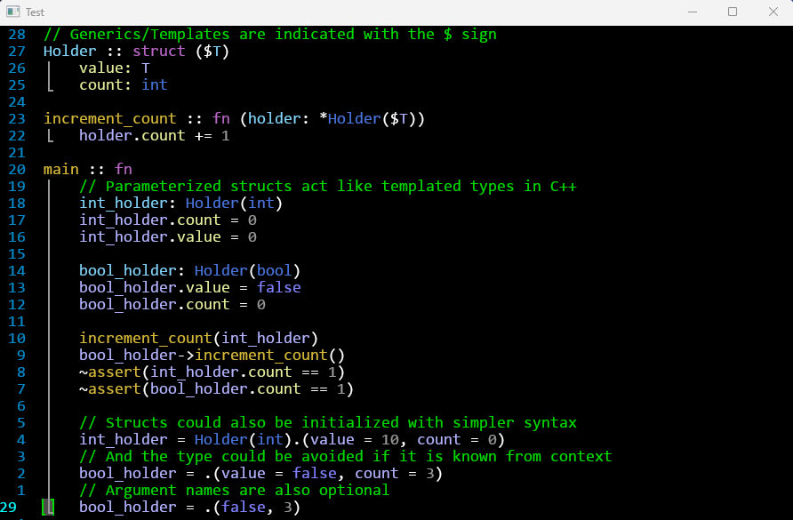
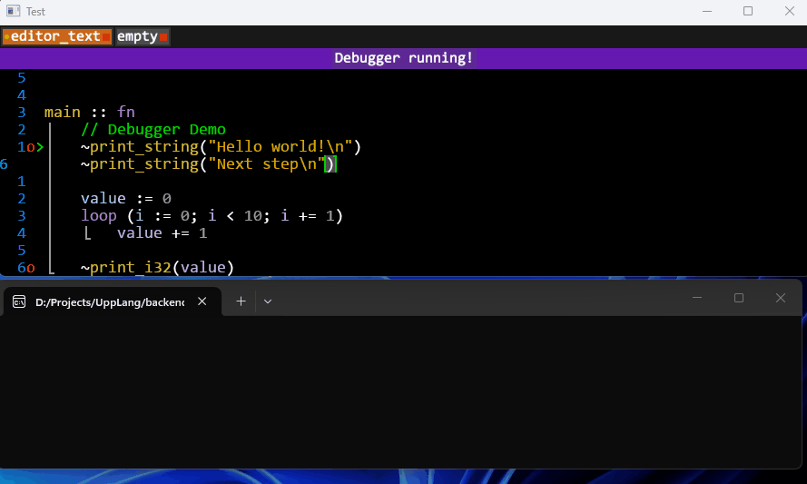
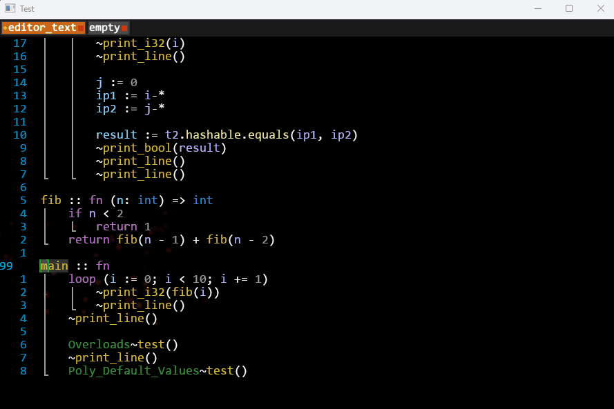

# UppLang
UppLang is a new programming language that I'm current developing as a hobby.
Although the goal of this project is to create a usable language as a replacement for C/C++ for other Hobby-Projects of mine, the focus of UppLang is my personal education and research.

The project currently includes:
 * A fully functioning text-editor featuring: 
    - Full Undo/Redo history
    - Syntax-Highlighting
    - Fuzzy Code-Completion
    - Goto-Definition
    - Displays Program-Information (Expression Types, Errors, function parameter types, ...)
    - Fuzzy text search
    - VIM-keybindings (Not documented, so I'm probably the only person that can use it properly)
 * The programming language/compiler 
    - Lexer, Parser, Semantic-Analyser, Intermediate Code Generator, Backend Code Generators
    - Bytecode generator + bytecode interpreter for fast compile-times and compile time code execution
    - C-Code backend, which generates C code that is then compiled using msvc for code-optimizations (LLVM backend is planned for the future)
    - Incremental compilation and hot-code reloading (Currently in development)
 * An integrated debugger
    - Step-into, step-out-of, step-over
    - Breakpoints
    - Watch window
    - Call-Stack window

The design of UppLang is strongly influenced by the following other Programming-Languages (most of which were in very early stages when this project started):
* Jai (Based on Jonathan Blow's development videos)
* Odin
* Zig
* Go

In this project I wanted to stick to a mostly C-Style programming style and I wanted to keep external dependencies minimal, so it also includes
 * Win32 Window handling
 * Rendering with OpenGL
 * Custom text rendering (Using TrueType library for font loading)
 * Custom immediate mode UI
 * Memory management with custom Allocators (although older parts of the code still use C++ style container classes)
 * Custom Datastructures (DynArray == std::vector, Hashtable, DependencyGraph) using the custom allocators
 The whole project is currently around ~75.000 lines of code handwritten without the use of AI.

# Gallery

